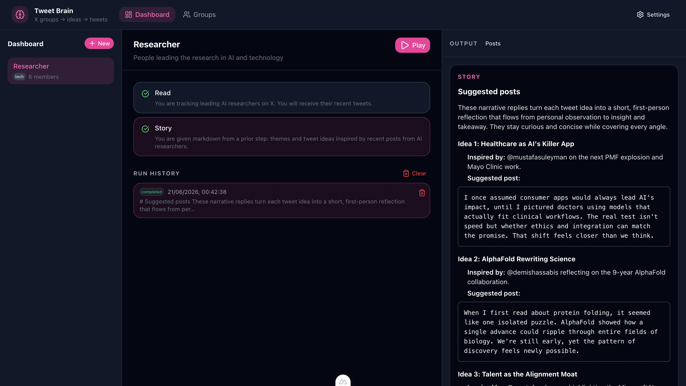
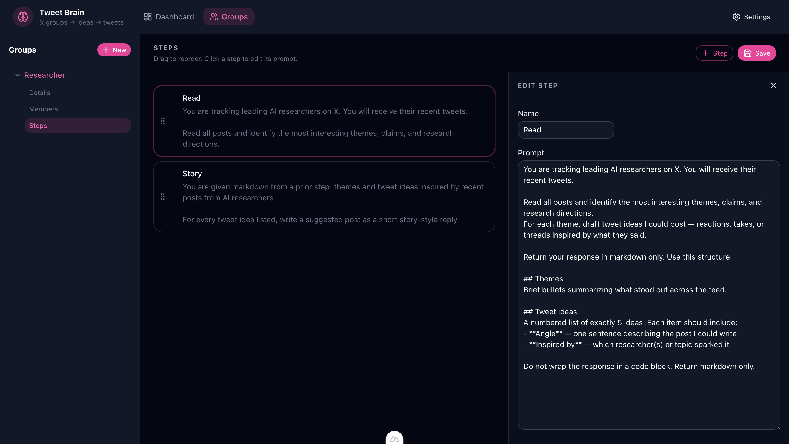

# Tweet Brain

A personal, local-first dashboard for tracking X (Twitter) account groups, collecting recent posts, and running LLM workflows to turn that signal into tweet ideas and draft posts.

All groups and data live in the [`database/`](database/) folder as YAML files — no external database required.

**Requirements:** You need [X API access](https://developer.x.com/) to read tweets and an [xAI API key](https://console.x.ai/) to request Grok LLM models.

<p align="center">
  
  
</p>

## Features

- **Account groups** — Organize tracked users by category (e.g. AI news, startups)
- **Post fetching** — Pull recent posts from group members via the [XDK Python SDK](https://docs.x.com/xdks/python/overview)
- **LLM pipeline** — Process posts through per-group prompts (stem → combine → craft) using [Grok via xAI](https://docs.x.ai/)
- **Dashboard** — Browse groups, view cached posts, and inspect workflow results

## Architecture

```
┌─────────────┐     REST API      ┌──────────────┐
│ Nuxt UI     │ ◄──────────────► │ FastAPI       │
│ Dashboard   │                  │ Backend       │
└─────────────┘                   └──────┬───────┘
                                         │
                    ┌────────────────────┼────────────────────┐
                    ▼                    ▼                    ▼
              database/            X API (xdk)          api.x.ai (Grok)
              YAML files
```

**Workflow:** Fetch posts → run each through the group's stem prompt → combine analyses into ideas → craft a draft tweet → save to `database/runs/`.

## Prerequisites

- Python 3.12+
- [uv](https://docs.astral.sh/uv/) (recommended) or pip
- Node.js 18+ and [Yarn](https://yarnpkg.com/)
- [X Developer account](https://developer.x.com/) with API credentials
- [xAI API key](https://console.x.ai/)

## Quick start

### 1. Clone and configure

```bash
git clone https://github.com/Saquib764/tweet-brain.git
cd tweet-brain
cp backend/.env.example backend/.env
# Edit backend/.env with your X API and xAI credentials
```

### 2. Backend

```bash
cd backend
uv sync
uv run uvicorn app.main:app --reload --port 8001
```

Verify: `curl http://localhost:8001/health`

### 3. Frontend

```bash
cd frontend
yarn install
yarn dev
```

Open [http://localhost:80](http://localhost:80).

## Database layout

```
database/
  groups.yaml       # Group definitions, accounts, and prompts
  settings.yaml     # API credentials (configure via Settings UI)
  posts/            # Cached fetches (gitignored at runtime)
  runs/             # Workflow results (gitignored at runtime)
```

Example group entry in `groups.yaml`:

```yaml
groups:
  - id: ai-news
    name: AI News
    category: tech
    description: Thought leaders in AI
    accounts: [sama, karpathy]
    fetch:
      posts_per_user: 10
    prompts:
      stem: |
        Analyze this tweet for actionable AI news angles...
      combine: |
        From these analyses, produce 5 distinct tweet ideas...
      craft: |
        Pick the best idea and write one tweet under 280 characters...
```

## Environment variables

| Variable | Description |
|----------|-------------|
| `X_BEARER_TOKEN` | X API bearer token (app-only) |
| `XAI_API_KEY` | xAI API key for Grok |
| `XAI_MODEL` | Grok model (default: `grok-4.3`) |
| `DATABASE_ROOT` | Path to `database/` (default: `../database`) |
| `CORS_ORIGINS` | Comma-separated frontend origins |
| `API_V1_PREFIX` | API prefix (default: `/api/v1`) |

## API overview

| Method | Path | Description |
|--------|------|-------------|
| GET | `/health` | Health check |
| GET | `/api/v1/groups` | List all groups |
| GET | `/api/v1/groups/{id}` | Group detail |
| POST | `/api/v1/groups/{id}/fetch` | Fetch and cache recent posts |
| GET | `/api/v1/groups/{id}/posts` | Get cached posts |
| POST | `/api/v1/groups/{id}/run` | Run LLM workflow |
| GET | `/api/v1/runs` | List workflow runs |
| GET | `/api/v1/runs/{run_id}` | Run detail |
| GET | `/api/v1/settings` | Get settings (masked secrets) |
| PUT | `/api/v1/settings` | Update settings (stored in `database/settings.yaml`) |

## Contributing

See [MASTER.md](MASTER.md) for internal project spec, data models, and roadmap.

## License

MIT
